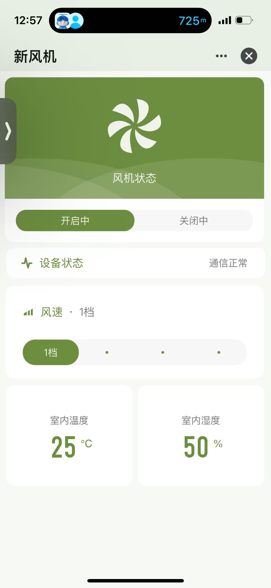
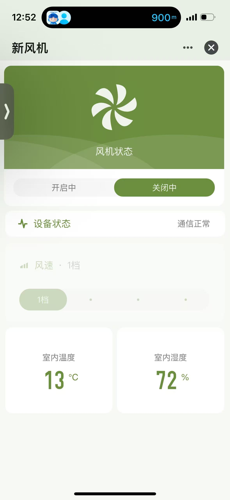
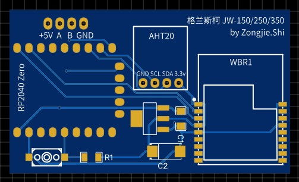
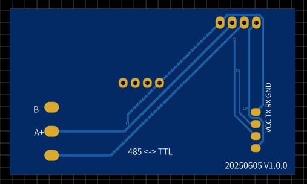

# griwind-tuya-iot

格兰斯柯新风系统接入涂鸦智能控制器和软件代码

## 项目简介

本项目实现了格兰斯柯 JW-150/250/350 双向流新风系统与涂鸦智能平台的对接，通过外挂控制器实现手机远程控制和状态监控。

### 背景

开发商交付的新风系统不支持米家、涂鸦等智能物联网平台，其自带的手机控制电路部分被阉割。新风厂家也不提供任何相关技术支持。

通过研究其他暖通网关的资料，结合智能家居论坛中其他网友的经验，反复实验后找到了通过外挂系统（暖通网关的控制原理）对新风机的方法和通信指令，并将其与涂鸦智能平台对接，实现可以在涂鸦智能中通过手机远程获取、控制新风机状态。

## 功能特性

### 已实现功能

- ✅ **风机控制**
  - 开关控制（启动/停止）
  - 风速调节（1~4档）
  - App 和面板（线控器）控制双向同步

- ✅ **状态监控**
  - 实时获取风机工作状态
  - 实时获取风速档位
  - 通信状态检测

- ✅ **环境监测**
  - 室内温度监测（AHT20 传感器）
  - 室内湿度监测（AHT20 传感器）

- ✅ **状态指示**
  - 网络状态 LED 指示灯
  - RGB LED 风速状态指示（WS2812）
    - 1档：蓝色
    - 2档：绿色
    - 3档：橙色
    - 4档：红色
    - 通信异常：红色闪烁

### 功能限制

目前**无法获取**的信息包括：

- 控制面板上显示温度
- 新风、排风风阀状态
- 滤网寿命

## 项目结构

```
griwind-tuya-iot/
├── MCU/                    # MCU 控制代码
│   ├── mcu.py              # 早期版本代码
│   ├── new_mcu.py          # 最新版本代码（推荐使用）
│   ├── 风机485协议.md      # RS485 通信协议文档
│   └── ModbusRTU指令.txt   # Modbus RTU 指令参考
├── Panel/                  # 原厂面板资料
│   ├── README.md           # 面板接口说明
│   ├── panel1.jpg          # 面板图片
│   ├── rs485_port.jpg      # RS485 接口位置
│   └── wireless_circurit.jpg
├── PCB/                    # 外挂控制器 PCB 设计资料
│   ├── pcb_design.jpg      # PCB 设计图
│   └── Gerber_PCB_2025-06-05.zip
├── pcb_top.jpg             # PCB 正面图
├── pcb_bottom.jpg          # PCB 背面图
├── tuya_app1.jpg           # 涂鸦 App 截图1
├── tuya_app2.jpg           # 涂鸦 App 截图2
└── README.md               # 本文件
```

## 硬件要求

### 核心组件

| 组件 | 型号 | 说明 |
|------|------|------|
| MCU | 树莓派 PICO (RP2040) | 兼容 RP2040 Zero 或 RP2040 Tiny |
| 无线模块 | 涂鸦 WBR1 | WiFi + 蓝牙物联网模组 |
| 温湿度传感器 | AHT20 | I2C 接口工业级传感器 |
| RGB LED | WS2812 | 风速状态指示（RP2040 Zero 集成） |
| RS485 转换模块 | TTL-485 | 位于 PCB 背面，用于 RS485 通信 |

### 硬件接口

| 接口 | 引脚 | 说明 |
|------|------|------|
| 涂鸦模块通信 | UART0 (GP0/GP1) | 115200 bps |
| RS485 通信 | UART1 (GP8/GP9) | 9600 bps, Modbus RTU |
| AHT20 传感器 | I2C1 (GP6/GP7) | 100kHz |
| 网络状态 LED | GP25 | 配网/联网状态指示 |
| RGB LED | GP16 | WS2812 风速指示 |
| 配网按钮 | GP28 | 长按 5 秒触发配网 |

### 新风面板接口

- **RS485 接口**：面板背面 RJ45 插座旁的白色插座（HY2.0 规格）
- **注意**：新款面板阉割了 485 接口，需要直连风机主板上的 485 接口

## 通信协议

### RS485/Modbus RTU

- **通信参数**
  - 波特率：9600 bps
  - 数据位：8
  - 停止位：1
  - 校验位：无
  - 协议：Modbus RTU

- **设备地址**：0xA1 (161)

- **寄存器定义**
  - `0x1005`：开关寄存器（0=关闭，1=开启）
  - `0x1007`：档位寄存器（1~4档）

详细协议文档请参考：[MCU/风机485协议.md](MCU/风机485协议.md)

### 涂鸦串口协议

MCU 与涂鸦 WBR1 模块采用涂鸦标准串口通信协议，具体参见参考资料章节。

## 快速开始

### 1. 硬件连接

1. 将控制器 PCB 连接到新风面板的 RS485 接口
2. 确保所有连接牢固可靠
3. 检查电源供电正常

### 2. 固件烧录

1. 使用 MicroPython 环境
2. 将 `MCU/new_mcu.py` 烧录到 RP2040
3. 配置涂鸦产品 ID（PID）：`b7zdedszp3gq3k9t`

### 3. 配网绑定

1. 长按配网按钮（GP28）5 秒，进入配网模式
2. LED 指示灯快速闪烁表示进入配网模式
3. 打开涂鸦智能 App，添加设备
4. 按照 App 提示完成配网和绑定

### 4. 使用说明

- **开关控制**：通过 App 控制风机开关
- **风速调节**：通过 App 设置 1~4 档风速
- **状态查看**：App 实时显示风机状态、温度、湿度
- **状态同步**：App 和面板控制可双向同步

## 效果展示

外挂控制器集成了 AHT20 温湿度传感器，用于获取室内的环境参数。可以通过涂鸦云端下发指令操作新风机的开关、风速状态。

 

## PCB 设计

### 主要特性

- **MCU**：树莓派 PICO，兼容 RP2040 Zero 或 RP2040 Tiny
- **RGB LED**：RP2040 Zero 集成了 WS2812 RGB LED，可用不同颜色组合表示风速状态
- **无线模块**：涂鸦 WBR1，WiFi + 蓝牙物联网模组
- **环境传感器**：AHT20 温湿度传感器，I2C 通信协议
- **RS485 接口**：TTL-485 模组位于 PCB 背面，负责 MCU 与新风面板的通信
- **配网按钮**：预留微动开关，用于 WiFi 模组配网和设备绑定

### PCB 图片





## 更新日志

### 2025.12.29

- ✅ 实现 App 和面板（线控器）控制之间双向同步风机状态
- ✅ 具备实际使用条件
- 📝 备注：新款面板阉割了 485 接口，需要直连风机主板上的 485 接口

### 2025.06.05

- ✅ 项目初始版本
- ✅ 适配格兰斯柯 JW-150/250/350 双向流新风系统
- ✅ 通过新风面板预留的 485 接口通信获取新风机工作状态
- ✅ 完成 PCB 设计和 MCU 代码开发

## 参考资料

- **涂鸦 WBR1 模组**：[数据手册](https://developer.tuya.com/cn/docs/iot/wbr1-module-datasheet?id=K9duisiao4qpa)
- **涂鸦串口协议**：[通信协议文档](https://developer.tuya.com/cn/docs/iot/tuya-cloud-universal-serial-port-access-protocol?id=K9hhi0xxtn9cb#title-0-%E4%B8%B2%E5%8F%A3%E9%80%9A%E4%BF%A1%E7%BA%A6%E5%AE%9A)
- **AHT20 模组**：[数据手册](https://files.seeedstudio.com/wiki/Grove-AHT20_I2C_Industrial_Grade_Temperature_and_Humidity_Sensor/AHT20-datasheet-2020-4-16.pdf)
- **WS2812 RGB**：[数据手册](https://cdn-shop.adafruit.com/datasheets/WS2812.pdf)
- **RS485 通信协议**：[MCU/风机485协议.md](MCU/风机485协议.md)

## 免责声明

⚠️ **重要提示**

1. **逆向工程**：本项目属于没有任何厂商资料的情况下的逆向工程，不对其正确性、稳定性提供任何保证。

2. **质保风险**：任何对原有新风机、控制面板的改动都可能影响质保服务，使用者需要自行承担其中的风险。

3. **使用责任**：使用者应充分了解相关风险，并在充分测试后再投入使用。作者不对因使用本项目造成的任何损失承担责任。

4. **技术支持**：本项目为个人研究项目，不提供商业技术支持。

---

**项目维护**：如有问题或建议，欢迎提交 Issue 或 Pull Request。
